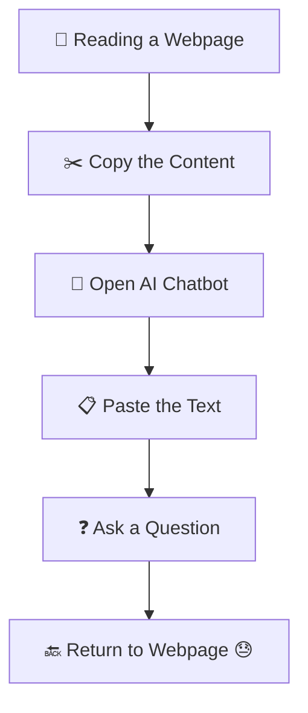
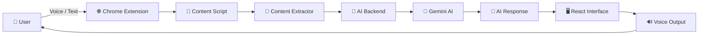
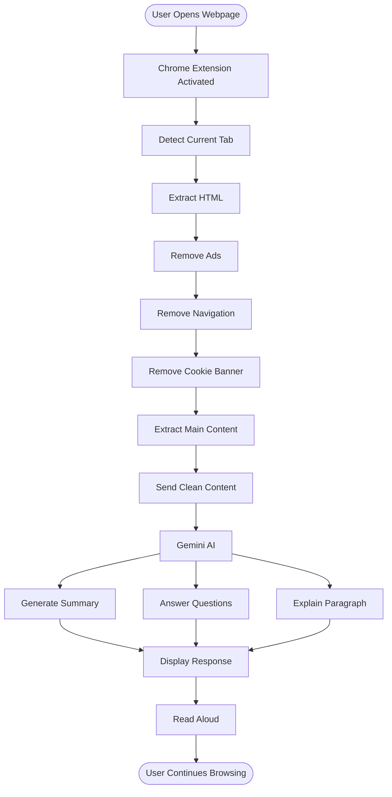
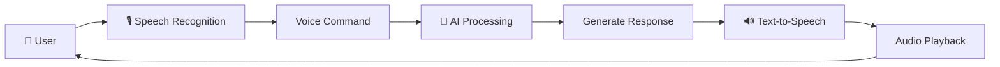
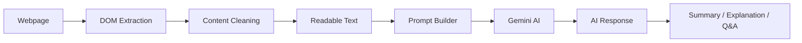

<div align="center">

# 🚀 Quantum AI
### 🧠 AI Browser Companion — Your Intelligent Web Browsing Assistant


<p align="center">


</p>

**🏆 Built for Hackathon 2026**
💙 Built with React • Chrome Extension • Gemini AI • Node.js

</div>

---

## 📑 Table of Contents

- [About Quantum AI](#-about-quantum-ai)
- [Problem Statement](#-problem-statement)
- [Our Solution](#-our-solution)
- [Key Features](#-key-features)
- [System Architecture](#️-system-architecture)
- [Tech Stack](#️-tech-stack)
- [Project Structure](#-project-structure)
- [Installation Guide](#️-installation-guide)
- [API Endpoints](#-api-endpoints)
- [Testing](#-testing-the-project)
- [Troubleshooting](#-troubleshooting)
- [Project Showcase](#-project-showcase)
- [Roadmap](#-future-roadmap)
- [Team](#-team)
- [Contributing](#-contributing)
- [License](#-license)

---

## 📖 About Quantum AI

Quantum AI is an AI-powered Chrome Extension that transforms the way users interact with web content.

Instead of copying text into ChatGPT or another AI chatbot, Quantum AI understands the webpage directly inside the browser and lets users communicate using natural language — text or voice.

Whether you're reading documentation, research papers, blogs, news articles, Wikipedia pages, or GitHub repositories, Quantum AI acts as your personal AI assistant by explaining, summarizing, reading aloud, and answering questions based only on the current webpage.

> **Read Less. Understand More. Stay Focused.**

---

## 🎯 Problem Statement

People spend hours every day consuming online content — research papers, news, documentation, Wikipedia, blogs, GitHub READMEs, product reviews.

Whenever something isn't clear, the usual workflow looks like this:



**Problems with this workflow:**

| Issue | Impact |
|---|---|
| ✂️ Constant copy-paste | Breaks flow of reading |
| 🪟 Multiple tabs | Hard to track context |
| ⏱️ Wastes time | Slower learning |
| 🧠 Breaks concentration | Lower comprehension |
| ♿ Poor accessibility | Not voice-friendly, hard for visually impaired users |
| 🔌 No real-time understanding | Manual re-explaining every time |

---

## 💡 Our Solution

Quantum AI lives inside your browser as a floating assistant. Instead of switching apps, you simply ask:

> 🗣 "Summarize this page" · "Explain this paragraph" · "Read this aloud" · "Give me a 2-minute summary" · "What does this mean?"

Quantum AI answers instantly, based only on the webpage currently open.

**Example conversation**

```text
👤 User: Summarize this article.

🤖 Quantum AI: This article explains the fundamentals of
Artificial Intelligence, Machine Learning, and Deep Learning
with real-world examples.
```

```text
👤 User: Explain this paragraph like I'm a beginner.

🤖 Quantum AI: Imagine Artificial Intelligence as teaching
a computer how to think and solve problems, similar to humans...
```

Unlike traditional AI chatbots, Quantum AI needs **no copy-pasting, no tab-switching, no interrupting your reading** — everything happens inside the browser itself.

---

## ✨ Key Features

### 🧠 AI Features

| Feature | Description |
|---|---|
| 📖 Smart Content Understanding | Understands the webpage using AI |
| 📝 AI Summarization | Generates short and detailed summaries |
| 💡 Paragraph Explanation | Explains difficult paragraphs in simple language |
| 🎓 Beginner Mode | Explains concepts like you're a beginner |
| ❓ Context-Aware Q&A | Answers questions based only on the current webpage |
| 🎯 Key Points Extraction | Reads only the important information |
| 📚 Long Article Reader | Makes lengthy articles easy to consume |
| 🔄 Context Memory | Remembers previous questions during the conversation |

### 🎤 Voice Features

| Feature | Description |
|---|---|
| 🎙 Speech Recognition | Talk to it naturally |
| 🔊 Text-to-Speech | AI reads webpages aloud |
| ⏸ Pause / ▶ Resume | Pause and continue reading anytime |
| ⏭ Skip Sections | Skip unnecessary parts |
| 🔁 Repeat | Repeat the previous explanation |
| 💬 Natural Conversation | Feels like talking to a human assistant |

### 🌐 Browser Features

| Feature | Description |
|---|---|
| 🧩 Chrome Extension | Runs directly inside Chrome |
| ⚡ Floating Action Button | Easy access from any webpage |
| 📄 Current Page Detection | Automatically detects the active tab |
| 📑 Smart Content Extraction | Extracts only meaningful content |
| 🚫 Removes Ads & Cookie Banners | Cleaner reading experience |
| 📌 Works Without Leaving the Page | No copy-paste required |

### 🌍 Supported Websites

Wikipedia · GitHub README · Medium · News Websites · Blogs · Documentation · Dev.to · Research Articles · Product Reviews · Educational Websites

### 💪 Competitive Advantage

| Traditional AI Chatbots | Quantum AI |
|---|---|
| ❌ Requires copy-paste | ✅ Works directly on the webpage |
| ❌ Needs multiple tabs | ✅ Single-click experience |
| ❌ Breaks workflow | ✅ Continuous browsing |
| ❌ Manual content selection | ✅ Automatic content detection |
| ❌ No voice reading | ✅ Natural voice assistant |
| ❌ Context lost frequently | ✅ Maintains conversation context |

### 🎯 Use Cases

- **👨‍🎓 Students** — study faster, understand research papers, summarize notes
- **👨‍💻 Developers** — read GitHub repos, understand docs, learn APIs quickly
- **📰 Readers** — summarize news, listen while multitasking
- **👨‍🔬 Researchers** — analyze papers, extract key findings
- **👨‍💼 Professionals** — read reports and documentation faster

---

## 🏗️ System Architecture

### High-Level Architecture



### Complete Workflow



### Voice Processing Pipeline



### AI Processing Pipeline



### Component Overview

| Component | Responsibility |
|---|---|
| 🌐 Chrome Extension | Runs inside the browser, interacts with webpages |
| 📄 Content Script | Reads webpage HTML and DOM |
| 🧹 Content Extractor | Removes ads, sidebars, navigation, cookie banners |
| ⚡ Backend API | Processes AI requests |
| 🤖 Gemini AI | Understands webpage and generates responses |
| 💬 React UI | Displays conversation and controls |
| 🎤 Speech Recognition | Converts voice into text |
| 🔊 Speech Synthesis | Reads AI responses aloud |

### 🔐 Privacy-First Design

✅ Only processes the current webpage · ✅ No browsing history collection · ✅ No permanent webpage storage · ✅ User-controlled interactions · ✅ Secure API communication · ✅ AI only receives cleaned webpage content

---

## 🛠️ Tech Stack

**Frontend**

| Technology | Purpose |
|---|---|
| ⚛ React.js | User Interface |
| ⚡ Vite | Fast development & build tool |
| 🎨 Tailwind CSS | Styling |
| 🧩 Chrome Extension API | Browser integration |
| 🎤 Web Speech API | Speech recognition |
| 🔊 Speech Synthesis API | Voice output |

**Backend**

| Technology | Purpose |
|---|---|
| 🟢 Node.js | Runtime environment |
| 🚀 Express.js | REST API server |
| 🔐 dotenv | Environment variables |
| 🌐 CORS | Cross-origin requests |
| 📦 Axios | API requests |

**AI**

| Technology | Purpose |
|---|---|
| 🧠 Google Gemini AI | AI conversation |
| 📄 Prompt Engineering | AI instructions |
| 💬 Context Management | Maintain conversation |
| 📝 AI Summarization | Smart summaries |
| 🎯 Question Answering | Context-aware answers |

**Content Extraction:** Mozilla Readability · DOM Parser · HTML Sanitizer · Custom Filters

**Browser APIs:** Chrome Tabs API · Chrome Scripting API · Chrome Storage API · Chrome Runtime API

**Major Dependencies**

```json
{
  "react": "^19.x",
  "vite": "^7.x",
  "express": "^5.x",
  "cors": "^2.x",
  "axios": "^1.x",
  "dotenv": "^17.x",
  "@google/generative-ai": "^0.x",
  "tailwindcss": "^4.x",
  "readability": "^0.x"
}
```

---

## 📂 Project Structure

```text
Quantum-AI/
│
├── client/
│   ├── public/
│   └── src/
│       ├── assets/
│       ├── components/
│       ├── pages/
│       ├── hooks/
│       ├── services/
│       ├── context/
│       ├── utils/
│       ├── styles/
│       ├── App.jsx
│       └── main.jsx
│
├── server/
│   ├── controllers/
│   ├── routes/
│   ├── middleware/
│   ├── services/
│   ├── config/
│   ├── utils/
│   └── app.js
│
├── extension/
│   ├── manifest.json
│   ├── background.js
│   ├── content.js
│   ├── popup.html
│   ├── popup.js
│   ├── popup.css
│   └── icons/
│
├── docs/
│   ├── screenshots/
│   └── architecture/
│
├── .env.example
├── README.md
└── LICENSE
```

---

## ⚙️ Installation Guide

### Prerequisites

| Software | Version |
|---|---|
| Node.js | v18+ |
| npm | Latest |
| Git | Latest |
| Google Chrome | Latest |

### Clone the Repository

> ⚠️ Replace `yourusername` with your actual GitHub username/org before publishing.

```bash
git clone https://github.com/yourusername/Quantum-AI.git
cd Quantum-AI
```

### Install Dependencies

```bash
# Frontend
cd client
npm install

# Backend
cd ../server
npm install

# Extension (if it has its own package.json)
cd ../extension
npm install
```

### Environment Variables

Create a `.env` file inside `server/`:

```env
PORT=5000
GEMINI_API_KEY=YOUR_GEMINI_API_KEY
CLIENT_URL=http://localhost:5173
```

**Getting a Gemini API Key**

1. Visit [Google AI Studio](https://aistudio.google.com/)
2. Sign in with your Google account
3. Click **Get API Key** → Create a new key
4. Copy it into your `.env` file

### Run the Backend

```bash
cd server
npm run dev
```

```text
Server running on http://localhost:5000
```

### Run the Frontend

```bash
cd client
npm run dev
```

```text
Local: http://localhost:5173
```

### Load the Chrome Extension

1. Open `chrome://extensions`
2. Enable **Developer Mode**
3. Click **Load Unpacked**
4. Select the `Quantum-AI/extension/` folder
5. Done ✅ — the extension icon will appear in your toolbar

### Build for Production

```bash
# Frontend
cd client
npm run build

# Backend
npm start
```

---

## 📡 API Endpoints

**Health Check**

```http
GET /api/health
```
```json
{ "status": "OK" }
```

**Generate AI Response**

```http
POST /api/chat
```
Request:
```json
{
  "message": "Summarize this article",
  "content": "Extracted webpage content..."
}
```
Response:
```json
{ "success": true, "response": "This article explains..." }
```

**Generate Summary**

```http
POST /api/summarize
```
Request:
```json
{ "content": "Long webpage content..." }
```
Response:
```json
{ "summary": "Short AI generated summary..." }
```

---

## 🧪 Testing the Project

Open a content-heavy page (Wikipedia, Medium, Dev.to, a GitHub README, a news site) and try:

- 🎤 "Summarize this page"
- 🎤 "Explain this paragraph"
- 🎤 "Read only the important points"
- 🎤 "What does this mean?"

---

## 🐞 Troubleshooting

**Extension not loading?**
✔ Enable Developer Mode · ✔ Check `manifest.json` · ✔ Reload the extension

**AI not responding?**
✔ Verify your Gemini API key · ✔ Confirm the backend is running · ✔ Check your internet connection

**Voice not working?**
✔ Allow microphone permission · ✔ Refresh the page · ✔ Enable speech recognition in browser settings

---

## 📸 Project Showcase

> ⚠️ Add your real screenshots to `docs/screenshots/` and update the paths below — these are placeholders and won't display until the files exist.

| Home | AI Chat | Voice Assistant | AI Summary | Extension Popup |
|---|---|---|---|---|
| `docs/screenshots/home.png` | `docs/screenshots/chat.png` | `docs/screenshots/voice.png` | `docs/screenshots/summary.png` | `docs/screenshots/popup.png` |

**Demo Video:** ⚠️ replace with your real YouTube link, e.g. `https://youtu.be/XXXXXXXXXXX`

**Live Demo:** _Coming soon_

---

## 📊 Performance Metrics

| Metric | Value |
|---|---|
| 🚀 AI Response Time | < 2 seconds |
| 📄 Supported Websites | 100+ |
| 🎤 Voice Commands | Supported |
| 🌍 Languages | Multi-language ready |
| 🔒 Privacy | Local page processing |
| ⚡ Browser Support | Chrome (Manifest V3) |

---

## 🌟 Future Roadmap

🌍 Multi-language translation · 🎙 Podcast mode · 📑 Reading progress sync · ☁ Google Drive integration · 📝 Notion integration · 📧 Email summaries · 📱 Mobile browser support · 🧠 Multi-agent AI · 📄 PDF understanding · 💻 Code explanation mode · 🌐 Edge support · 🦊 Firefox support

---

## 🧑‍💻 Team

> ⚠️ Replace names, roles, and avatar images below with your actual team info before publishing.

| Member | Role | Name |
|---|---|---|
| Team Member 1 | Project Lead / Frontend | Munjal Raval |
| Team Member 2 | Backend / AI Integration | Jay Patel |
| Team Member 3 | Chrome Extension / DOM Extraction | Ansh Patel |
| Team Member 4 | Voice Assistant / Testing | Arpan Shah |

---

## 🤝 Contributing

1. Fork the repository
2. Create your feature branch: `git checkout -b feature/NewFeature`
3. Commit your changes: `git commit -m "Added New Feature"`
4. Push to your branch: `git push origin feature/NewFeature`
5. Open a Pull Request

Found a bug or have an idea? Open an [Issue](../../issues) or a feature request — contributions are welcome ❤️

---

## 📜 License

Licensed under the **MIT License**.

```text
MIT License
Copyright (c) 2026 Quantum AI
Permission is hereby granted, free of charge, to any person obtaining
a copy of this software...
```

---

## 🙏 Acknowledgements

Google Gemini AI · React Team · Node.js Community · Mozilla Readability · Chrome Extensions Team · Open Source Community - Ollama - Gemma4

---

<div align="center">

# 🚀 Quantum AI
**Read Less • Learn Faster • Stay Focused**

⭐ Star this repository if you found it useful — it motivates us to build more open-source projects!

Made with ❤️ by Team Quantum AI


</div>
